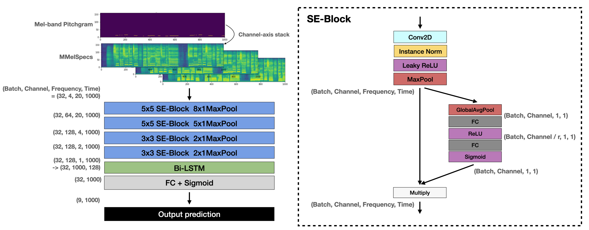
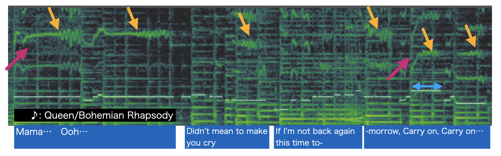
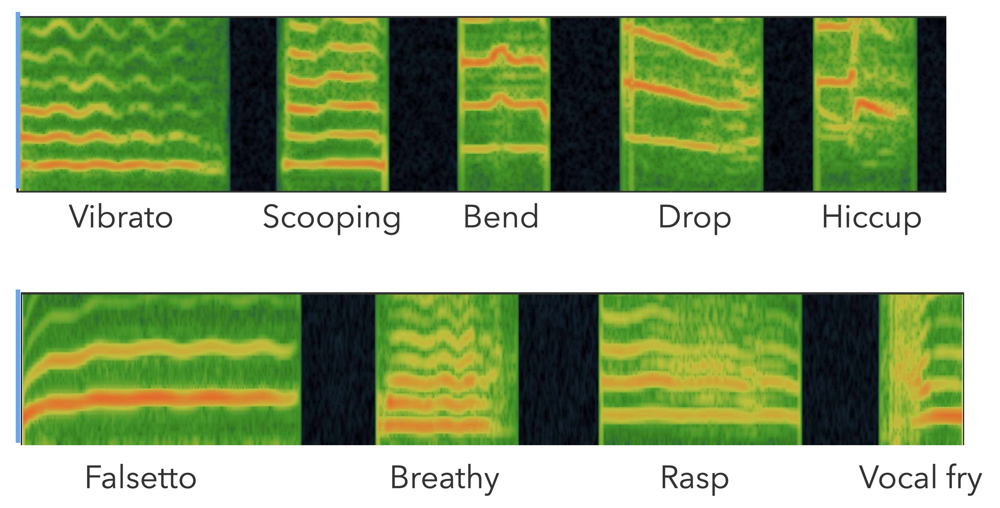
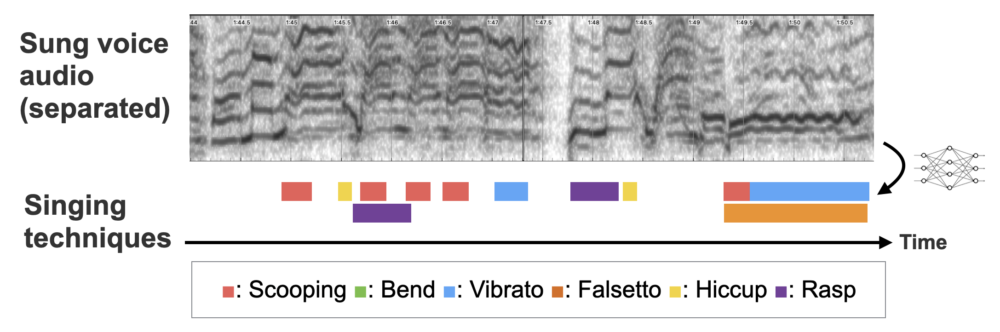
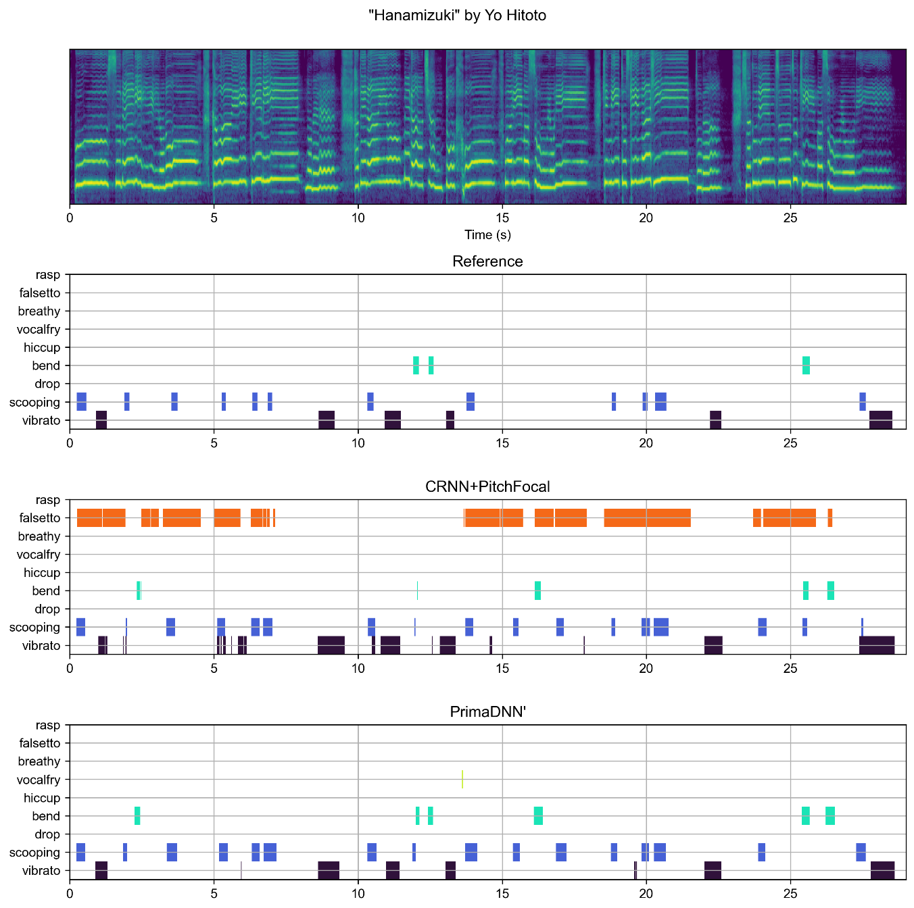
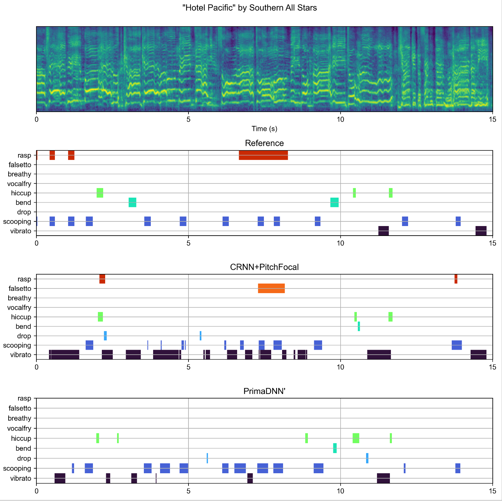
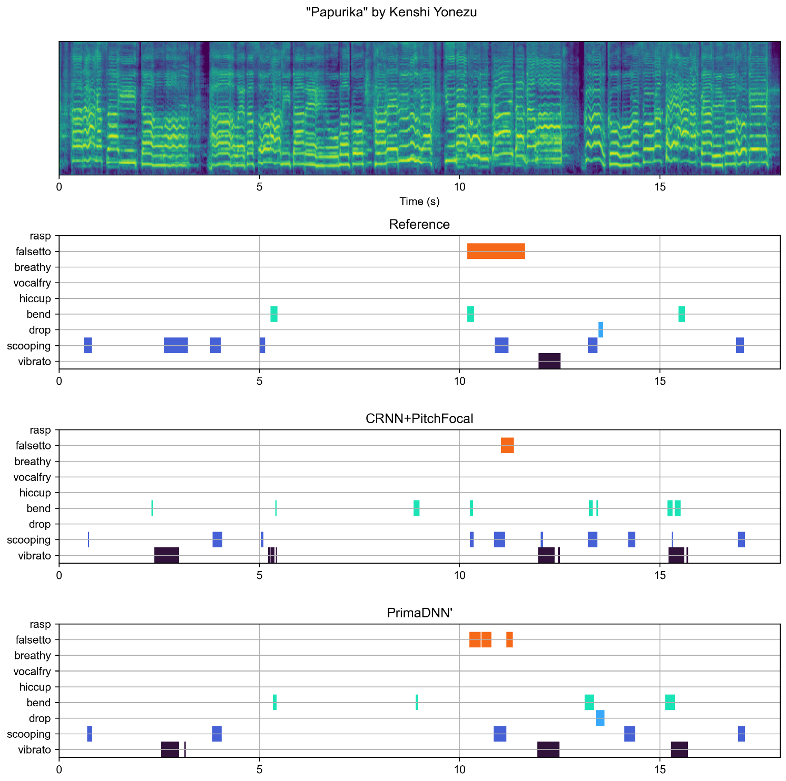
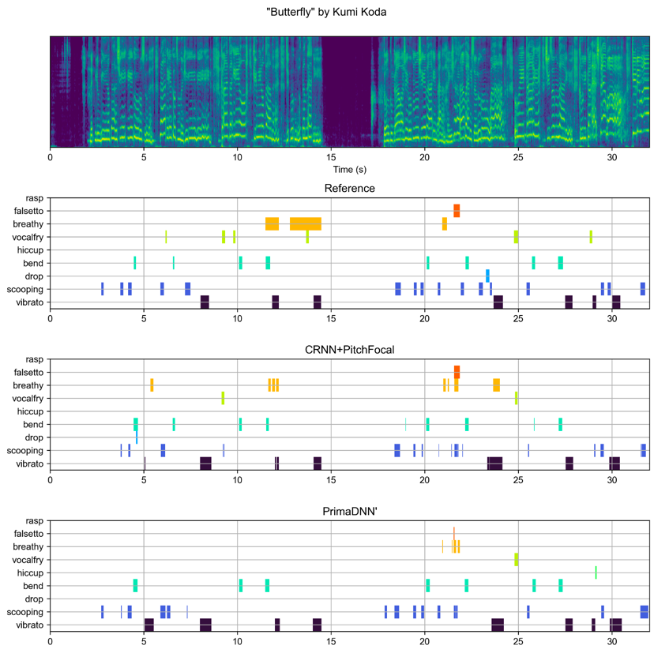
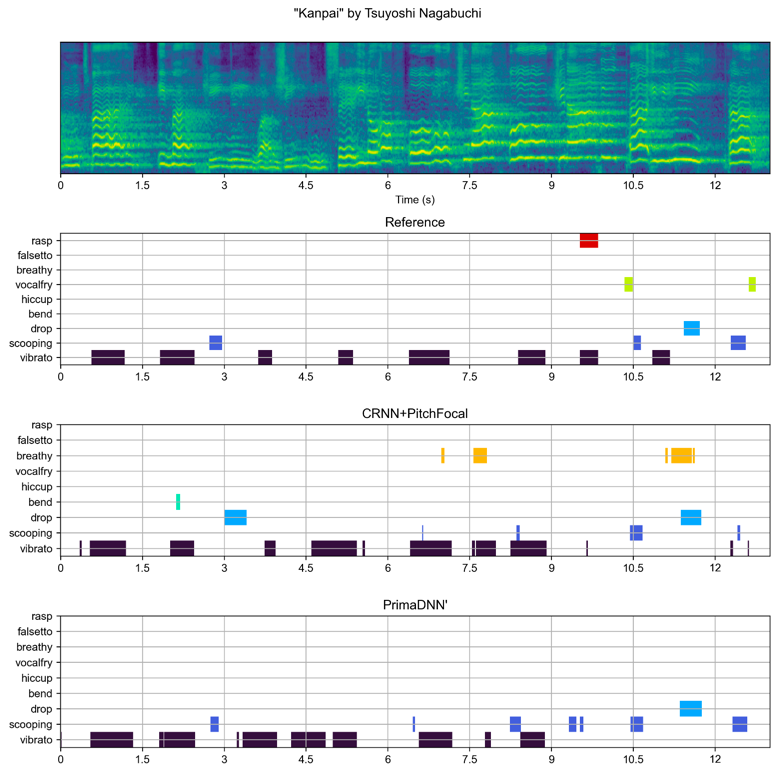

# PrimaDNN':A Characteristics-aware DNN Customization for Singing Technique Detection


## Abstract
```
Professional vocalists modulate their voice timbre or pitch to make their vocal performance more expressive. Such fluctuations are called singing techniques. 
Automatic detection of singing techniques from audio tracks can be beneficial to understand how each singer expresses the performance, yet it can also be difficult due to the wide variety of the singing techniques. 
A deep neural network (DNN) model can handle such variety; however, there might be a possibility that considering the characteristics of the data improves the performance of singing technique detection. 
In this paper, we propose PrimaDNN, a CRNN model with a characteristics-oriented improvement. 
The features of the model are: 1) input feature representation based on auxiliary pitch information and multi-resolution mel spectrograms, 2) Convolution module based on the Squeeze-and-excitation (SENet) and the Instance normalization.
In the results of J-POP singing technique detection, PrimaDNN achieved the best results of 44.9\% at the overall macro-F measure, compared to conventional works.
We also found that the contribution of each component varies depending on the type of singing technique. 
```

<div style="text-align: center;">
    
</div>

## Presentation video
<iframe width="560" height="315" src="https://www.youtube.com/embed/JsqRfNKljX0?si=45I4yFjU4QbRIh3m" title="YouTube video player" frameborder="0" allow="accelerometer; autoplay; clipboard-write; encrypted-media; gyroscope; picture-in-picture; web-share" allowfullscreen></iframe>

## Singing techniques??
<iframe width="560" height="315" src="https://www.youtube.com/embed/fJ9rUzIMcZQ?si=xRD8sWP2aXf478WY&amp;start=84" title="YouTube video player" frameborder="0" allow="accelerometer; autoplay; clipboard-write; encrypted-media; gyroscope; picture-in-picture; web-share" allowfullscreen></iframe>


**Pink: Portamento, Yellow:Vibrato, Light Blue: Falsetto**

Actual vocalists are singing often with expressions. Such expressions are realized by fluctuation of pitch, loudness, timbre, and so on (including not to fluctuate). 
There are some well-known fluctuation patterns like vibrato, portamentos, falsetto etc. 
In this work, focusing on nine common singing techniques, we aim to demonstrate automatic detection of singing techniques given sung audio.

## Used techniques 

We used the [COSIAN dataset](https://yamathcy.github.io/ISMIR2022J-POP/) and picked up **nine common techniques**.

#### Category 1: Pitchy
  + **vibrato**: a periodic oscillation of pitch.
  + **scooping**: a pitch evolution like upward glissando.
  + **bend**: a short tremolo or U/inverted U-shaped pitch evolution.
  + **drop**: a pitch evolution like downward glissando.
  + **hiccup**: a short hiccupping on attack/release of note.

#### Category 2: Timbral
  + **falsetto**: sung by falsetto register.
  + **breathy**: breathy sound.
  + **rasp**: sung by a creaky voice, with subharmonics.
  + **vocal fry**: sung by a creaky voice, and pulse register phonation.

### Identification settings
**Detection**: kinds and region


### Detection examples 

#### Good examples
Hanamizuki / Yo Hitoto
<iframe width="560" height="315" src="https://www.youtube.com/embed/TngUo1gDNOg?si=ZTq1FkmAZKiXH6vv&amp;start=64" title="YouTube video player" frameborder="0" allow="accelerometer; autoplay; clipboard-write; encrypted-media; gyroscope; picture-in-picture; web-share" allowfullscreen></iframe>


Hotel Pacific / Southern All Stars
<iframe width="560" height="315" src="https://www.youtube.com/embed/TjmoaDFXCOo?si=hHdXv5wVEfwC_1Zf&amp;start=75" title="YouTube video player" frameborder="0" allow="accelerometer; autoplay; clipboard-write; encrypted-media; gyroscope; picture-in-picture; web-share" allowfullscreen></iframe>


Papurika / Kenshi Yonezu 
<iframe width="560" height="315" src="https://www.youtube.com/embed/s582L3gujnw?si=Ed-EXvZGBa0zRq6_&amp;start=57" title="YouTube video player" frameborder="0" allow="accelerometer; autoplay; clipboard-write; encrypted-media; gyroscope; picture-in-picture; web-share" allowfullscreen></iframe>


#### Bad examples
Butterfly / Kumi Koda
<iframe width="560" height="315" src="https://www.youtube.com/embed/JDtHaS5htnY?si=Khjzez-9Tdez9dvE&amp;start=60" title="YouTube video player" frameborder="0" allow="accelerometer; autoplay; clipboard-write; encrypted-media; gyroscope; picture-in-picture; web-share" allowfullscreen></iframe>


The PrimaDNN' failed to detect breathy and vocal fry at several points.

Kanpai / Tsuyoshi Nagabuchi
<iframe width="560" height="315" src="https://www.youtube.com/embed/-Ch-ilTDBnw?si=-zNrOR7VKo4XUL57&amp;start=86" title="YouTube video player" frameborder="0" allow="accelerometer; autoplay; clipboard-write; encrypted-media; gyroscope; picture-in-picture; web-share" allowfullscreen></iframe>


The PrimaDNN' failed to detect rasp and vocal fry at several points and poor localization of vibrato.

